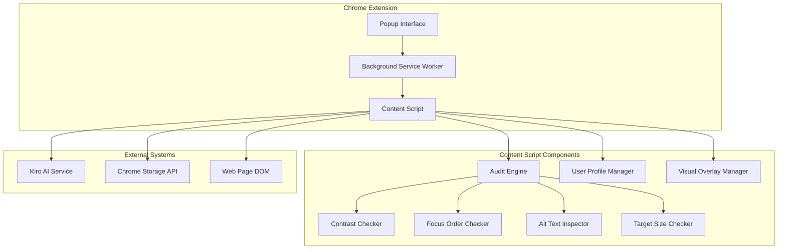
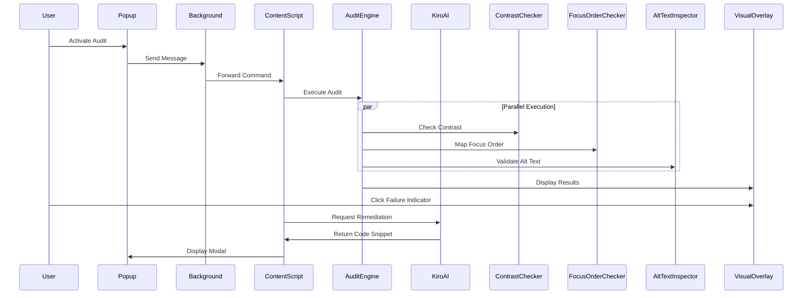

# Design Document

## Overview

The Triple-Threat Audit Orchestrator is architected as a modular Chrome extension that provides simultaneous accessibility auditing through three core inspection engines: Contrast Analysis, Focus Order Mapping, and Alt Text Validation. The system employs a centralized orchestration pattern with independent feature modules, AI-powered remediation suggestions, and persistent user accessibility profiles.

The design emphasizes performance, maintainability, and extensibility while ensuring WCAG 2.1 compliance and seamless integration with existing web content.

## Architecture

### High-Level Architecture



### Component Interaction Flow



## Components and Interfaces

### 1. Audit Engine (Central Orchestrator)

**Purpose**: Coordinates the execution of all accessibility checking modules and manages audit state.

**Key Methods**:
```javascript
class AuditEngine {
    async executeFullAudit(): Promise<AuditResults>
    async executePartialAudit(modules: string[]): Promise<AuditResults>
    getAuditState(): AuditState
    clearAuditResults(): void
}
```

**Responsibilities**:
- Orchestrate parallel execution of audit modules
- Aggregate and normalize audit results
- Manage audit timing and performance constraints
- Provide unified interface for audit operations

### 2. Contrast Checker Module

**Purpose**: Analyzes color contrast ratios according to WCAG 2.1 guidelines.

**Key Methods**:
```javascript
class ContrastChecker {
    calculateContrastRatio(foreground: string, background: string): number
    checkElement(element: HTMLElement): ContrastResult
    scanAllElements(): ContrastResult[]
    isWCAGCompliant(ratio: number, level: 'AA' | 'AAA'): boolean
}
```

**Algorithm**:
1. Parse computed CSS color values (RGB, RGBA, HSL)
2. Calculate relative luminance using WCAG formula
3. Compute contrast ratio: (L1 + 0.05) / (L2 + 0.05)
4. Compare against AA (4.5:1) and AAA (7:1) thresholds

### 3. Focus Order Checker Module

**Purpose**: Maps keyboard navigation order and identifies focusable elements.

**Key Methods**:
```javascript
class FocusOrderChecker {
    getFocusableElements(): HTMLElement[]
    calculateTabOrder(): FocusOrderResult[]
    validateLogicalOrder(): ValidationResult
    highlightFocusPath(): void
}
```

**Focus Detection Logic**:
- Query selectors: `a[href], button, input, textarea, select, details, [tabindex]:not([tabindex="-1"])`
- Handle positive tabindex values with priority sorting
- Detect programmatically focusable elements
- Validate logical reading order vs. tab order

### 4. Alt Text Inspector Module

**Purpose**: Validates alternative text for images and media elements.

**Key Methods**:
```javascript
class AltTextInspector {
    inspectImages(): AltTextResult[]
    validateAltText(text: string): ValidationResult
    detectDecorativeImages(): HTMLImageElement[]
    checkComplexImages(): ComplexImageResult[]
}
```

**Validation Rules**:
- Detect missing alt attributes
- Identify empty or whitespace-only alt text
- Flag placeholder text ("image", "photo", etc.)
- Validate descriptive quality for complex images

### 5. Visual Overlay Manager

**Purpose**: Manages non-interactive visual indicators for audit results.

**Key Methods**:
```javascript
class VisualOverlayManager {
    createOverlayContainer(): SVGElement
    addIndicator(element: HTMLElement, type: string, data: any): void
    clearAllIndicators(): void
    handleIndicatorClick(event: Event): void
}
```

**Implementation Strategy**:
- Single SVG container with high z-index (9999)
- Pointer-events: none for non-interference
- Absolute positioning relative to target elements
- Event delegation for click handling

### 6. Kiro AI Integration

**Purpose**: Provides AI-generated remediation suggestions for accessibility failures.

**Interface**:
```javascript
interface KiroAIService {
    generateRemediation(context: FailureContext): Promise<RemediationResult>
    formatPrompt(element: HTMLElement, failureType: string): string
    validateResponse(response: string): boolean
}
```

**Context Capture**:
```javascript
interface FailureContext {
    elementHTML: string
    failureType: 'contrast' | 'focus' | 'alt-text' | 'target-size'
    wcagCriterion: string
    computedStyles: CSSStyleDeclaration
    parentContext: string
}
```

### 7. User Profile Manager

**Purpose**: Manages layered accessibility modifications for cognitive and motor needs.

**Profile Application Sequence**:
1. **Text Simplification**: DOM manipulation to reduce complexity
2. **Font Override**: CSS injection for dyslexia-friendly fonts
3. **BeeLine Reader**: CSS gradient application for reading guidance

**Key Methods**:
```javascript
class UserProfileManager {
    applyProfile(profileName: string): Promise<void>
    removeProfile(): Promise<void>
    persistProfileState(domain: string): Promise<void>
    loadProfileState(domain: string): Promise<ProfileState>
}
```

## Data Models

### Audit Results Structure

```javascript
interface AuditResults {
    timestamp: number
    pageUrl: string
    results: {
        contrast: ContrastResult[]
        focusOrder: FocusOrderResult[]
        altText: AltTextResult[]
        targetSize: TargetSizeResult[]
    }
    summary: {
        totalIssues: number
        criticalIssues: number
        wcagLevel: 'A' | 'AA' | 'AAA'
    }
}

interface ContrastResult {
    element: HTMLElement
    ratio: number
    isCompliant: boolean
    level: 'AA' | 'AAA'
    foregroundColor: string
    backgroundColor: string
    wcagCriterion: '1.4.3' | '1.4.6'
}

interface FocusOrderResult {
    element: HTMLElement
    tabIndex: number
    visualOrder: number
    isLogical: boolean
    wcagCriterion: '2.4.3'
}

interface AltTextResult {
    element: HTMLImageElement
    altText: string | null
    isPresent: boolean
    isDescriptive: boolean
    isDecorative: boolean
    wcagCriterion: '1.1.1'
}
```

### User Profile Configuration

```javascript
interface UserProfile {
    name: string
    enabled: boolean
    modifications: {
        textSimplification: boolean
        dyslexiaFont: 'opendyslexic' | 'comic-sans' | 'verdana'
        beelineReader: boolean
        highContrast: boolean
        fontSize: number
    }
    persistence: {
        domain: string
        lastApplied: number
        autoApply: boolean
    }
}
```

## Error Handling

### Graceful Degradation Strategy

1. **Module Isolation**: Failures in individual audit modules do not affect others
2. **Timeout Handling**: 2.5-second timeout for audit operations with partial results
3. **DOM Access Errors**: Retry mechanism for elements that become unavailable
4. **Kiro AI Failures**: Fallback to static remediation suggestions
5. **Storage Errors**: In-memory fallback for profile persistence

### Error Recovery Patterns

```javascript
class ErrorHandler {
    async withRetry<T>(operation: () => Promise<T>, maxRetries: number = 3): Promise<T>
    handleModuleFailure(moduleName: string, error: Error): void
    logError(context: string, error: Error): void
    showUserFriendlyMessage(error: Error): void
}
```

## Testing Strategy

### Unit Testing Approach

**Contrast Checker Tests**:
- Color parsing accuracy (RGB, RGBA, HSL, named colors)
- Luminance calculation precision
- WCAG threshold validation
- Edge cases: transparent backgrounds, inherited colors

**Focus Order Tests**:
- Focusable element detection completeness
- Tab order calculation accuracy
- Logical order validation
- Dynamic content handling

**Alt Text Inspector Tests**:
- Missing alt attribute detection
- Empty/whitespace validation
- Decorative image identification
- Complex image analysis

### Integration Testing

**Audit Engine Coordination**:
- Parallel module execution timing
- Result aggregation accuracy
- State management consistency
- Performance under load

**Visual Overlay Integration**:
- Positioning accuracy across viewport sizes
- Event handling without page interference
- Z-index layering correctness
- Cleanup on navigation

### Performance Testing

**Benchmarks**:
- Full audit completion: < 2.5 seconds (500 elements)
- Content script injection: < 500 milliseconds
- Memory usage: < 10MB baseline
- Visual overlay rendering: < 100 milliseconds

**Load Testing Scenarios**:
- Large pages (1000+ elements)
- Complex CSS layouts
- Dynamic content updates
- Multiple simultaneous audits

### Browser Compatibility Testing

**Target Browsers**:
- Chrome 88+ (primary)
- Chromium-based browsers (Edge, Brave)
- Different viewport sizes and zoom levels
- Various operating systems (Windows, macOS, Linux)

## Security Considerations

### Content Security Policy Compliance

- No inline JavaScript execution
- CSP-safe CSS injection methods
- Secure message passing between components
- Sanitized HTML in remediation suggestions

### Privacy Protection

- No external data transmission
- Local storage encryption for sensitive preferences
- Minimal permission requirements
- User consent for AI feature usage

### XSS Prevention

- Input sanitization for user-generated content
- Safe DOM manipulation practices
- Secure event handler attachment
- Validation of external API responses